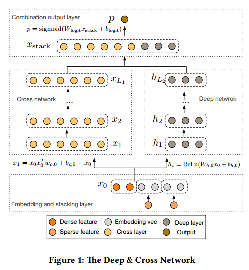

# DCN

创建日期 2018/12/29

创建人 Leon0427


下面就让我们开始从头创建一个deep and cross(DCN)吧

### 1.deep and cross network 简要介绍

如figure1所示，DCN由
+ embedding and stack layer,
+ cross network
+ deep network
+ combination output layer

四个部分构成。

接下来我们就要用tensorflow来实现这四部分网络结构，并用实现的DCN来对数据进行分类了。



图来源 Ruoxi Wang, Bin Fu, Gang Fu, Mingliang Wang,  *Deep & Cross Network for Ad Click Predictions* .

### 2.数据集介绍

本样例使用的数据集来自于Kaggle竞赛：Porto Seguro’s Safe Driver Prediction

赛题的核心是根据司机的历史数据预测司机次年提出保险赔偿的概率。显然这是一个与ctr预估类似的二分类问题。

数据集以csv的格式存放，分为训练集和测试集，可以从.example/data/README.md中的链接中下载

数据集每条数据的列数均为59列，其中一些列如“ps_car_14”是连续特征，另外一些列如“ps_car_02_cat”是离散特征。具体的某列特征是离散还是连续可以在.example/config.py中查看

### 3. DCN项目路径介绍

本项目路径如下
```
DCN/
  |_____example/
  |           |_____data/             *数据*
  |           |_____config.py         *配置项*
  |           |_____data_reader.py    *数据加载相关*
  |           |_____log.py            *打印日志*
  |           |_____main.py           *训练主流程：包括加载数据、训练DCN*
  |
  |_____fig/
  |
  |_____deep_and_cross.py             *DCN模型*
```
主要的文件有三个：
+ deep_and_cross.py
+ main.py
+ data_reader.py

### 4. embedding and stacking layer